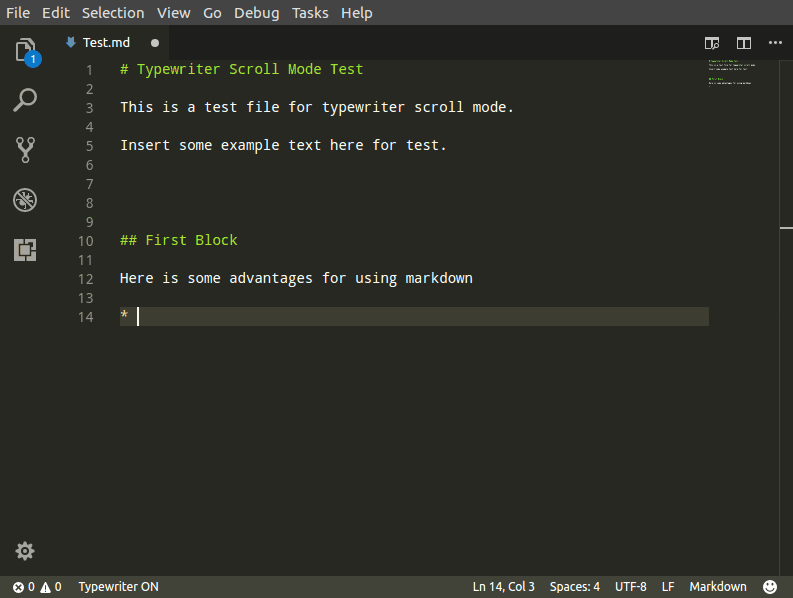
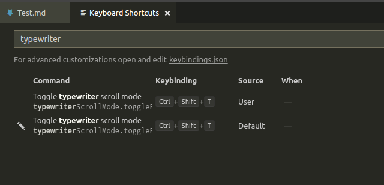

# Typewriter Scroll Mode

Use typewriter's scroll mode in markdown files and plain text files. Inspired by [typera](https://www.typora.io/) editor.

## Features

Usage example:

## Extension Settings

This extension contributes the following settings:

* `typewriterScrollMode.enable`: enable/disable this extension

You can also use shortcut to toggle enable this extension.
the default shortcut key is `Ctrl+Shift+T`.

You can modify this setting by searching `Toggle typewriter scroll mode` 
in `Keyboard Shortcuts` setting page.

## Known Issues

* Can't scroll screen to center when document's line is less than half of the screen size;

## Release Notes
 
### 1.0.0 (2017-09-10)

Initial release of Typewriter Scroll Mode

-----------------------------------------------------------------------------------------------------------
 